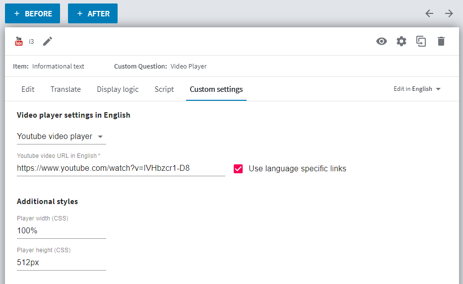
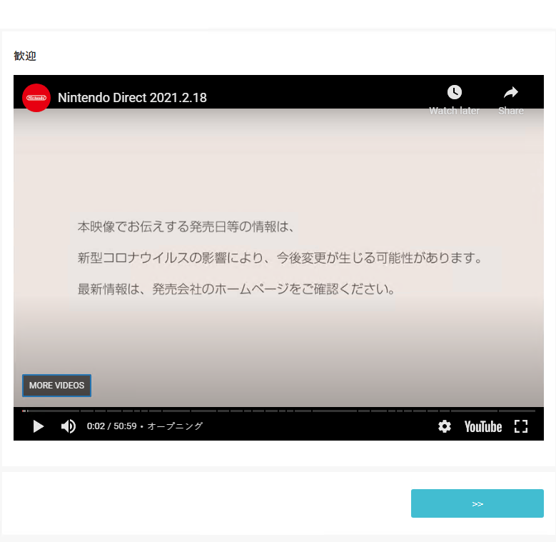

# Video Player CustomQuestion example

Info form based CQ which renders a video player for specified video link. 
Supports basic html5 video player and youtube player. 
Also support different links for different survey languages.

### This example illustrates

- runtime implementation is in vanilla js (without dependencies) and design implementation is in react using material-ui components
- common folder code is shared between design and runtime
- fallback to the same default CQ settings in both design and runtime
- css styles as part of parcel pipeline
- custom react components with its own state and debouncer
- render some code conditionally only in devmode session (debug)
- uses onInit instead of onSettingsReceived with manual state handling
- optional multi language support

### Screenshots

Settings page in Survey Designer with language-specific youtube video value.

Runtime component rendered a video player for Japanese respondent showing Japanese video.

